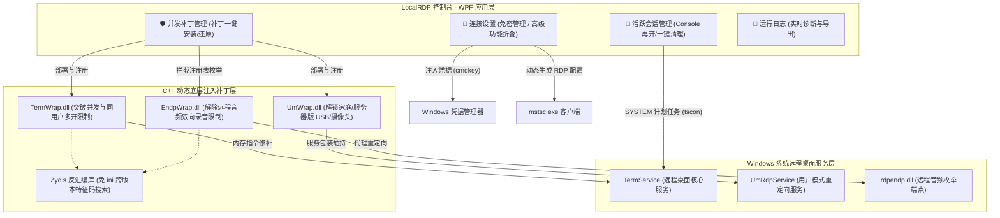
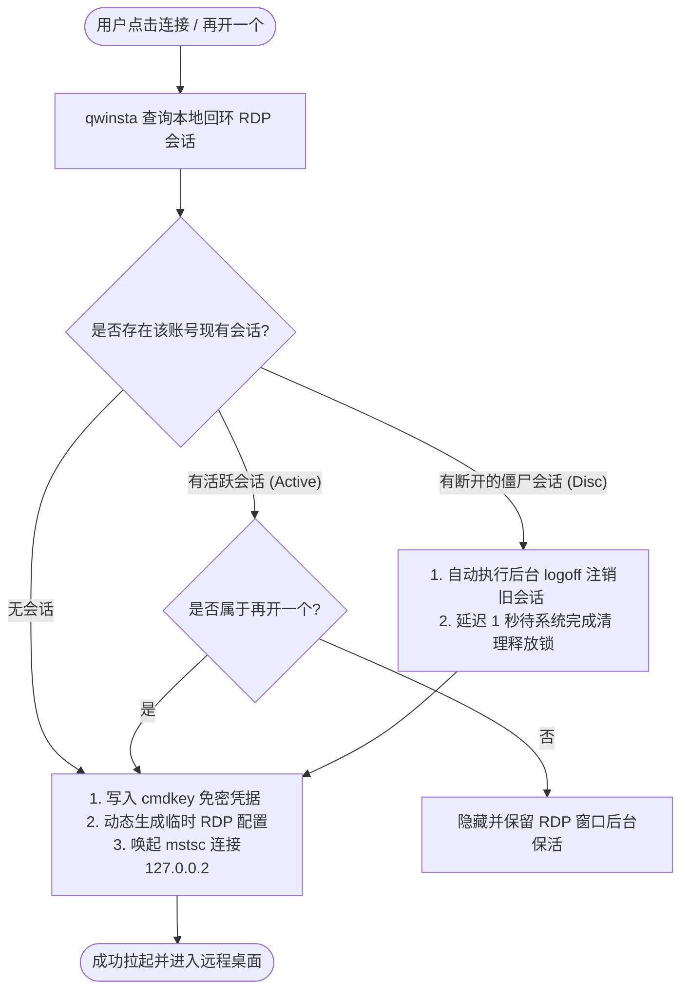

  

<h1 align="center">LocalRDP</h1>

  <b>安全、免维护、双架构自适应的本地多用户并发远程桌面控制台</b>

  
  
  

---

## 📱 软件界面

  

---

## 📖 项目简介

LocalRDP（原 rdpManager）是一款基于 WPF (C#) 开发的 Windows 多用户并发远程桌面管理平台。它旨在通过图形化界面为个人、开发者及 RPA (机器人流程自动化) 环境提供 stable、流畅、一键部署的本地回环多会话并发环境，支持同账户无限多开、物理控制台保活重定向、外设与音频双向保活重定向等高级特性。

---

## 🛠️ 软件功能结构

本项目的核心功能采用 **WPF 控制台层 + 智能调度业务层 + 底层 C++ 动态补丁层** 的三层架构，结构如下图所示：

---

## 🚀 核心技术与实现原理

### 2.1 内存动态反汇编补丁（免维护特征码搜索）
传统的远程桌面并发补丁（如旧版 RDPWrap）通常高度依赖静态的 `.ini` 偏移配置文件。一旦 Windows 安装安全更新升级了核心文件（如 `termsrv.dll`），配置就会失效，导致远程桌面服务崩溃或失效。
- **动态修补**：LocalRDP 集成的 `TermWrap` 使用高性能反汇编库 **Zydis** 在运行时对 `termsrv.dll` 的内存映像进行反汇编和分析，动态定位并发数限制和单用户限制的判定条件特征码。
- **免维护性**：在 Windows 安全更新升级核心 DLL 后，它能够自动重算并找到新的偏移地址进行热补丁，从而彻底杜绝了因系统更新导致远程桌面崩溃的隐患。

### 2.2 智能多开与防冲突调度逻辑
Windows 系统即使解除了并发限制，在处理“同账号多开”或“断开后重连”时仍容易产生旧会话锁死、黑屏或匹配错误。LocalRDP 对此引入了自动化无感调度流：

- **免密自动登录**：程序自动将密码缓存注入到 Windows 凭据管理器的 `TERMSRV/127.0.0.2` 作用域下，使得唤起系统 `mstsc.exe` 时跳过用户交互提示，实现单键秒连。

### 2.3 物理 Console 级后台保活重定向
对于很多 RPA 挂机和游戏辅助软件，一旦远程桌面窗口断开，虚拟屏幕的 GPU 渲染链和键鼠输入流就会中断，导致挂机程序报错退出。
- **保活重定向**：LocalRDP 提供了一键“保活断开”功能。它会在后台通过 Windows 计划任务临时提权到 `SYSTEM`，静默执行 `tscon [SessionId] /dest:console` 将该远程虚拟会话的音频、画面和 GPU 渲染无缝重定向回物理主显卡输出，并配合 PowerShell 强刷控制台分辨率。
- **显卡防锁死**：即使关闭远程客户端，后台应用依旧能够完整借用主机的物理显卡和 GPU 驱动进行渲染，不会触发黑屏或休眠。

---

## 📋 使用说明与操作步骤

### 步骤 1：部署并发与多开补丁
1. 以 **管理员身份** 运行 LocalRDP 控制台。
2. 展开“并发补丁管理”面板，点击 **“安装补丁”**。
3. 控制台会在后台下载或解压最新的 C++ 底层动态补丁（同时适配并支持 x64 与 x86 系统），完成内存指令修改。
4. 安装完成后，当看到 **“TermWrap”** 和 **“音频保活 (EndpWrap)”** 状态显示为绿色 **“已启用”** 时，即表示并发环境已配置就绪。

### 步骤 2：建立免密虚拟桌面连接
1. 在“连接设置”面板输入要登录的本地 Windows 用户账号及对应密码。
2. 点击 **“新增/连接”** 按钮。程序会自动将免密凭据写入系统，并唤起系统的 `mstsc.exe` 建立安全的环回连接。
3. **同账号多开**：如需再次登入同一用户账户以获取多路虚拟屏幕，只需在勾选 **“单账户多开”** 选项后，重复点击连接即可。

### 步骤 3：进行物理 Console 级挂机保活
1. 若要保持会话在远程窗口关闭后继续使用物理 GPU 硬件渲染（防止画面黑屏锁屏，极适合挂机/RPA 场景）：
2. 在“活跃会话管理”列表中选中您当前已登录的会话，点击 **“物理保活断开”**。
3. 系统将静默使用 `SYSTEM` 权限将当前会话的视频、音频及外设重定向至物理显示器 Console，随后正常关闭您的 RDP 客户端。

### 步骤 4：清理断开的僵尸会话
- 当不需要某些会话运行，或因异常出现卡死状态时，点击活跃会话面板的 **“一键清理”** 按钮，系统将自动对所有处于 `Disconnected` 状态的僵尸会话进行批量注销，释放服务器资源。

---

## ⚠️ 注意事项与防坑指南

1. **管理员权限要求**  
   由于本工具涉及对 `TermService` 系统服务状态的控制、部署 DLL 劫持文件至 System32 目录以及修改关键注册表值，**程序运行时必须获得管理员权限 (Run as Administrator)**，否则部分功能将无法生效。
   
2. **杀毒软件白名单**  
   本工具在底层会对核心系统 DLL（`termsrv.dll`）进行运行时反汇编热补丁并挂钩，可能会被 Windows Defender 或其他安全软件判定为高风险操作而拦截。若遇到补丁“安装失败”或“未生效”，请将 `C:\Program Files\RDP Wrapper` 文件夹及 `LocalRDP.exe` 添加至安全软件的白名单/排除项中。

3. **空密码限制**  
   根据 Windows 系统的默认安全策略，**远程桌面不支持空密码（无密码）账户的连接**。请确保需要建立虚拟连接的 Windows 账户已在系统内设置了有效登录密码。

4. **双架构运行机制**  
   - LocalRDP 自身为主流 Windows 64 位平台编译的 `win-x64` 应用程序，无法直接在 32 位操作系统上双击运行。
   - 但它在内嵌层**完美携带了 x64 与 x86 双架构的 C++ DLL 原生补丁**。在 64 位系统上部署时，它会自适应地释放 64 位补丁；在控制台远程操作 32 位受控端环境时，它也能完整覆盖并适配其补丁释放规则（x86 环境不激活不支持的 EndpWrap 音频组件，不破坏系统原生稳定性）。

---

## 🧑‍💻 开发与系统环境要求

- **操作系统**：Windows 10 / Windows 11 (x64) 的所有版本（包括家庭版、专业版、企业版及 LTSC 长期服务版）。
- **运行环境**：.NET Desktop Runtime 8.0 (x64) 及以上。
- **编译工具（如需二次开发）**：Visual Studio 2022。

---

## 🤝 引用与致敬的开源项目

本项目的底层依赖和关键算法受到了以下开源社区的启发与支持：

1. **[TermWrap](https://github.com/llccd/TermWrap)**  
   本项目所集成并使用的底层 RDP 补丁与重定向核心，提供了动态反汇编特征码定位及高级多媒体重定向的底层实现。
2. **[rdpwrap](https://github.com/stascorp/rdpwrap)**  
   远程桌面多并发连接补丁的先驱，奠定了 Windows 多会话重写与动态挂钩的架构基础。
3. **[RDPWrapOffsetFinder](https://github.com/llccd/RDPWrapOffsetFinder)**  
   提供了免维护的二进制特征匹配算法，用于解析和定位远程桌面的内部跳转判定。
4. **[Zydis](https://github.com/zyantific/zydis) & [Zycore](https://github.com/zyantific/zycore-c)**  
   高性能 x86/x64 反汇编和机器码解析库。用于在 `TermWrap` 和 `EndpWrap` 的 C++ 底层注入中对系统的机器指令集进行精准反汇编与热补丁，确保动态替换不引发内存越界。
